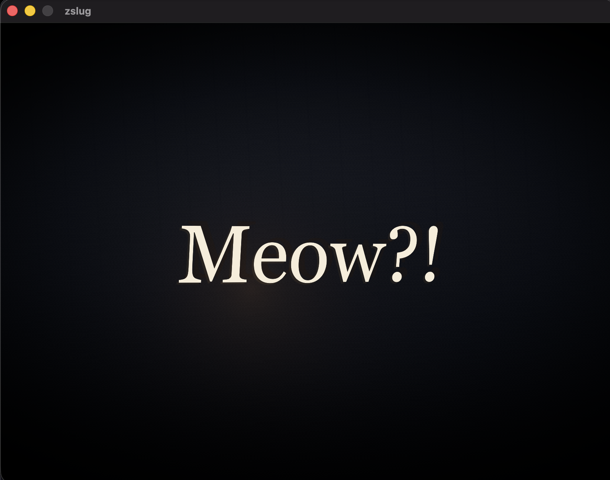

# zslug

Text rendering on the GPU via the [Slug algorithm](https://github.com/EricLengyel/Slug).

Written with Zig + WebGPU



## Usage

Clone, build, and run the default demo:

```bash
git clone https://github.com/braheezy/zslug
cd zslug
zig build run
```

Use the mouse to orbit/pan/zoom the text. Revel in it.
